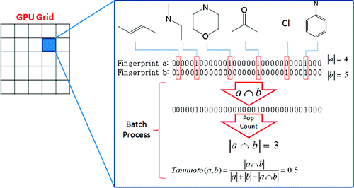
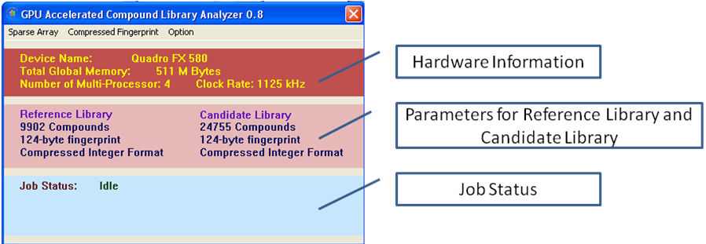
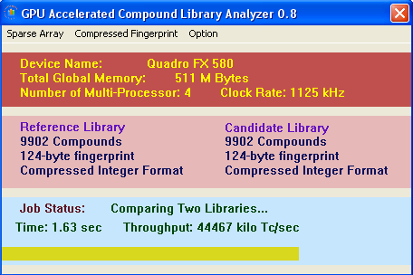
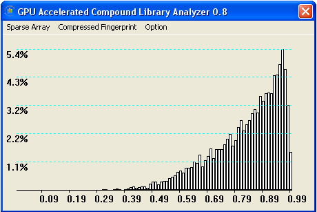

<h2> GPU Accelerated Chemical Similarity Calculation </h2>

This is one of my research projects at graduate school. Let me begin with a story: 

I love PC Gaming. Back to 2007, I just entered graduate school and got a free Dell PC from my department. Yes, a "free" PC. It came with a "cheap" graphic card, GeForce 8300. Later on, that graphic card model was shown defective and resulted in massive recall. NVidia stock price tumbled for that. Honestly, that card sucked. I couldn't play my favorite "Need for Speed, Shift", not even in the lowest resolution. Of course I was not supposed to expect too much out of free stuff.

Coincidentally, the department head wanted to install Linux on his computer. Not many students in drug discovery institute were that into computers. So I was the one doing it. OMG, his computer was a beast. GeForce 8800 Ultra inside, for scientific research definitely. That card cost at least $500 that time. With no doubt, I got a free try on that machine. The gaming performance blew up my mind. Smooth! Everything was smooth! 

Obviously I couldn't afford that much for gaming. A few months later, NVidia released a newer cropped model, GeForce 8800 GT. It cost about $260, but still not affordable for a graduate student. From then on, I started to follow hardware news, and got to know unified shader, GPGPU, CUDA, etc. I heard of CUDA technology from there. I was so fascinated, and I dreamed to have a compatible device. These days I still like to join the talk when my co-workers are discussing GeForce GTX 980 Ti with SLI.

3 years later, my lab bought a new desktop. Luckily, it had a Quadro FX 580 graphic card! Even though it was a low-end professional graphic card, at least I could try CUDA on it! It only supported CUDA 1.1. There were tons of hardware features missing compared to architecture nowadays, especially compared to Kepler. I downloaded NVidia CUDA SDK and started to play with it. It opened a new world for me! I knew some parallel programming before, such as process, thread, mutex, semaphore, etc. But the way how GPU worked was beyond my knowledge. Even trivial job like "retrieving integers larger than 256 in an array" was pretty difficult for me that time. Little by little, I learnt shared memory, coalesced memory access, thread synchronization, thread branching, etc. Also there were so many interesting algorithms in parallel computing, such as stream reduction and histogram creation. I mainly learnt from a book called "GPU Gems". In the end, I was able to implement an efficient sorting algorithm from scratch: sorting network + merge sort. It was fun. I would say the most difficult part was debugging. Debugging GPU code was quite annoying: copy the value from GPU memory to CPU memory and printf. Everything was in low level C code. Now NVidia has Microsoft Visual Studio integration. It is much simpler.

Next, I needed to justify why I was doing this. Then I came up with this idea, using GPU to compute chemical similarity matrix.  
 - It was useful. Many data mining algorithm require pair-wise comparison (clustering, nearest neighbor search);  
 - It was computational expensive. N-by-N matrix is pretty big if N is 100K for example. 100K in chem-informatics is common. Furthermore, the matrix can't be saved in RAM. Instead it needs to be computed at runtime. 
 - Last, it was good for GPU. Use O(N) memory space to output O(N-square) complexity data is what GPU is good at. Otherwise, time would be wasted at transferring data from RAM to GPU Memory. Not worth it.  
 - Most importantly, my advisor wouldn't bother me for "research plan", "progress report", and I could do something I was interested in.  

In the end, the work was published at JCIM, one of the leading scientific journals in chem-informatics. 
<a href = "http://pubs.acs.org/doi/citedby/10.1021/ci1004948"> Linked to the Publication </a> 

This was NIH funded project, so it is also open for public access:  
<a href = "http://www.ncbi.nlm.nih.gov/pmc/articles/PMC3445263/"> Full Article at NIH </a> 

Here is the abstract:

 
<small>Chemical similarity calculation plays an important role in compound library design, virtual screening, and lead optimization. In this manuscript, we present a novel GPU-accelerated algorithm for all-vs-all Tanimoto matrix calculation and nearest neighbor search. By taking advantage of multi-core GPU architecture and CUDA parallel programming technology, the algorithm is up to 39 times superior to the existing commercial software that runs on CPUs. Because of the utilization of intrinsic GPU instructions, this approach is nearly 10 times faster than existing GPU-accelerated sparse vector algorithm, when Unity fingerprints are used for Tanimoto calculation. The GPU program that implements this new method takes about 20 minutes to complete the calculation of Tanimoto coefficients between 32M PubChem compounds and 10K Active Probes compounds, i.e., 324G Tanimoto coefficients, on a 128-CUDA-core GPU.</small>

The basic idea is: 
 - each logical thread block i (a GPU core physically) computes all values in a row of N-by-N matrix.  
 - each logical thread j in block i computes matrix(i, j) value, so all threads in this block have access to on-chip shared memory.  
 - find the nearest neighbors and create histogram of similarities to nearest neighbors. Nearest neighbor similarity is saved in thread registers 

The project was created in Visual Studio C++ 2005. It needs NVidia C compiler to compile GPU code. <strong>"src/CudaCLA.sln"</strong> is the solution file for Visual Studio C++ 2005. <strong>"src/Cuda.rules"</strong> is the imported custom build rule for CUDA (copied from NVidia SDK). All GPU related logics are coded in <strong>"src/CudaCLA/CUDACLA.cu"</strong>, This includes kernel functions (instructions for GPU threads to execute) and interface with CPU functions, such as graphic memory allocation, graphic memory to main memory transfer, etc. There is also a simple UI. Core UI logics are in <strong>"src/CudaCLA/CudaCLADlg.cpp"</strong>

 
Display hardware information and summary of loaded data. 

 
Runtime status, showing progress and computation throughput. 

 
Display histogram of similarities to nearest neighbors.

I don't mean this is well-engineered project with beautiful code. This is simply to show my learning experience. 

GPU is fast, fast for arithmetic calculation, not for general-purpose computing. I ever had a netbook with Ion GPU inside. The netbook's CPU was Intel Atom, and Ion GPU only had 2 CUDA cores. When I ran the code on it, it was as fast as a Xeon CPU. 

Now let's continue the story. I am still using the old "free" desktop. I put a SSD in it, upgraded its power supply and installed a mid-range AMD graphic card. It is an 8-year-old computer, but I can play Dota 2. The load time is on average actually. Maybe kids play games on laptops these days. 

I don't write CUDA code anymore, not even C/C++ code. Instead, I write Python and Java, sometimes javascript. I would use OpenCL instead of CUDA, as Intel is the largest Video chip maker. They recently start to support OpenCL on their integrated GPU. Intel is catching up. Low-end graphic cards are not worth buying anymore. Also, this is era of cloud computing. For performance, people go for Spark, Hadoop, etc. Furthermore, "thrust" library is ready for use. People no longer need to write low level "stream reduction" code. So let this passion sleep for a while. Maybe one day I will awake it.

